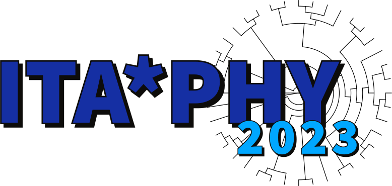

# itaphy2023
Repository of the ITA*PHY workshop - 2023 edition

[](https://sites.google.com/view/itaphylogeneticsworkshop)

## Introduction
##### [Opening slides](https://drive.google.com/file/d/1w40u4ufSD28muhuL3kQuiKZXnZaN9bsc/view?usp=sharing)

Clone the itaphy2023 repository before starting the tutorials:
```git clone https://github.com/itaphyworkshop/itaphy2023.git```

## Day 1 - The ice breaker day
Here we broke the ice with some basic Bash, and a session of flash talks from the participants.
#### Folders:
##### 1. flash_talks

## Day 2 - The error day
Trees are based on alignments and distances. Here we covered how to download and format data before and during phylogenetic analysis, with particular attention to some possible mistakes that can bring to inaccurate tree inference.
#### Slides:
##### 1. [Systematic errors and replacement models](https://docs.google.com/presentation/d/1bEE0KxEskEpKIC7e_fwgB6Q3R_GdNRnO/edit?usp=sharing&ouid=113307526437925014307&rtpof=true&sd=true)
##### 2. [Molecular clock](https://docs.google.com/presentation/d/1uyWt-keqObQWrDMqtPiWkNEL_-8IjFrh/edit?usp=sharing&ouid=113307526437925014307&rtpof=true&sd=true)
#### Folders:
##### 1. dpp1
##### 2. ML_TreeInference
##### 3. beast_tutorial

## Day 3 - The gene-tree day
New approaches can now leverage multicopy gene families, so that phylogenetic inference is no longer restricted to the tiny fraction of single-copy genes.

## Day 4 - The clock day
Bayesian approaches to divergence estimation can now analyze genome-scale datasets and hundreds of taxa.
##### [Closing slides](https://drive.google.com/file/d/15YXyCS9SX75pvDoYArHlVKLIyqjONsaa/view?usp=sharing)
