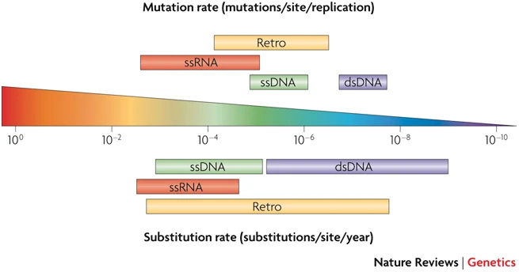

# BEAST tutorial for the ITA\*PHY 2023 workshop
To make BEAST available on your computer, source the ```phyworkshop.sh``` file:
```
source /usr/local/etc/phyworkshop.sh
```
Download the alignment:
```
wget https://raw.githubusercontent.com/itaphyworkshop/itaphy2023/main/beast_tutorial/beast_practical_wnvl2.fa
```
Run BEAUti and import the alignment to setup the analysis:
```beauti```

Run the ```.xml``` file in BEAST:
```beast```

Inspect the .log file with Tracer:
```tracer```

Get the tree from the .trees file using TreeAnnotator (set a 10& burnin and select the ```median heights``` option):
```treeannotator```

## Rate prior


Duffy, S., Shackelton, L. & Holmes, E. Rates of evolutionary change in viruses: patterns and determinants. Nat Rev Genet 9, 267–276 (2008). https://doi.org/10.1038/nrg2323

## Webpage with more BEAST tutorials:
https://taming-the-beast.org/
